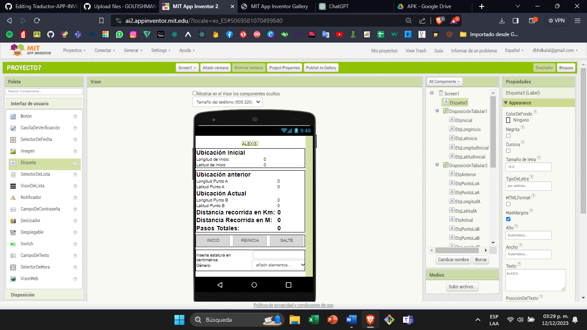
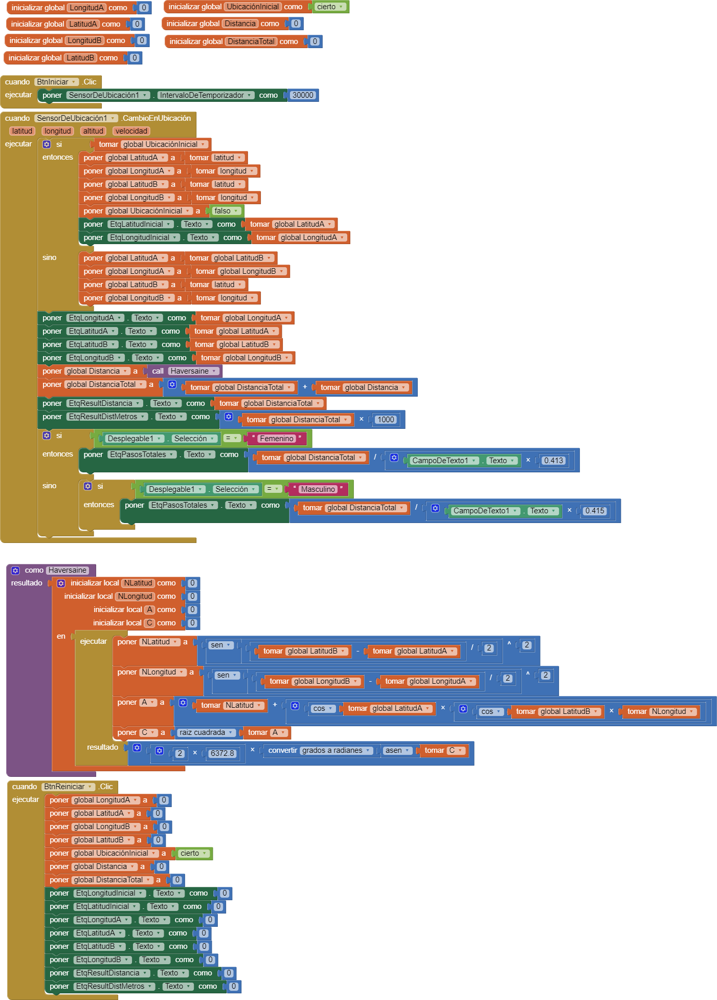

# UBICACIÓN PROYECTO 7

## Objetivo

Utilizar el sensor de ubicación para medir la distancia en latitud y longitud en tiempo real así como guardar la ubicación anterior y te da una próxima de los pasos totales sin la necesidad de ocupar el podómetro

## Componentes

### Disposición de la Pantalla con Nuevas Funcionalidades:

1.  **Etiqueta con Título:**
    1.  Título: "Ubicación Inicial"
2.  **Disposición Horizontal:**
    1.  Etiqueta para la Ubicación Inicial:
        1.  Contiene la Longitud de Inicio y la Latitud de Inicio
3.  **Disposición Tabular:**
    1.  Contiene los siguientes datos:
        1.  Ubicación Anterior: Longitud del Punto A y Latitud del Punto A
        2.  Ubicación Actual: Longitud del Punto B y Latitud del Punto B
        3.  Distancia Recorrida en Kilómetros
        4.  Distancia Recorrida en Metros
        5.  Pasos Totales
4.  **Disposición con 3 Botones:**
    1.  Botón de Inicio
    2.  Botón de Reiniciar
    3.  Botón de Saltar
5.  **Apartado para Ingresar Datos:**
    1.  Campo para Ingresar Estatura en Centímetros
    2.  Opciones de Género: Masculino / Femenino
6.  **Aproximación de la Distancia Recorrida Total:**
    1.  Calculada en función de la Estatura y el Género para ofrecer un total aproximado

## BLOQUES

## FUNCIONAMIENTO DE BLOQUES

Funciona de la siguiente manera inicia todas las variables globales de latitud longitud de punto A Y punto B con el sensor de ubicación inicia el recorrido y con la formula de Radianes hace que puedas calcular los pasos Y con el botón de reinicio pone a cero todos las variables

## LINK DE GALERIA
<a href="https://gallery.appinventor.mit.edu/?galleryid=198fb988-73e1-4fa5-8e49-e9c796895290" style="text-decoration: none; display: inline-block; padding: 10px 20px; border: 2px solid #555; border-radius: 5px; background-color: #007bff; color: #fff; font-size: 16px;" rel="noopener">
  GALERÍA
</a>

## link de APK
<a href="https://drive.google.com/file/d/1_Sx1rv6-B5kKjlH5wFuneBBHje6JzapQ/view?usp=sharing" style="text-decoration: none; display: inline-block; padding: 10px 20px; border: 2px solid #555; border-radius: 5px; background-color: #007bff; color: #fff; font-size: 16px;" rel="noopener">
  APK
</a>

